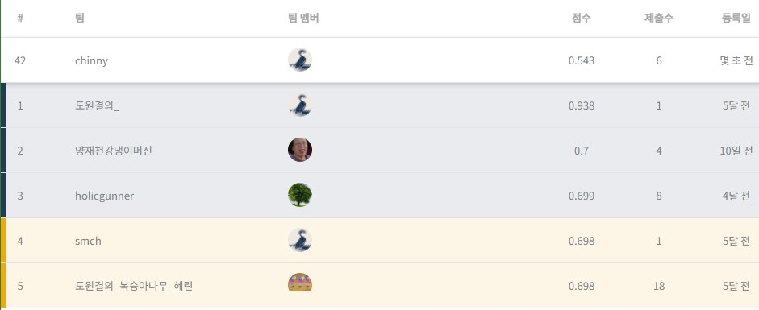

# Wine Classifcation
## 1. Goal
와인의 성분 및 품질을 통해 와인의 품질 예측

## 2. Dataset
https://archive.ics.uci.edu/ml/datasets/Wine+Quality

## 3. Model
```python
model = tf.keras.Sequential([
            tf.keras.layers.Dense(128, activation='relu'),
            tf.keras.layers.Dense(1024, activation='relu'),
            tf.keras.layers.Dense(64, activation='relu'),
            tf.keras.layers.Dense(1)
        ])
```
## 4. Result

[Link](https://dacon.io/competitions/open/235610/leaderboard/)

